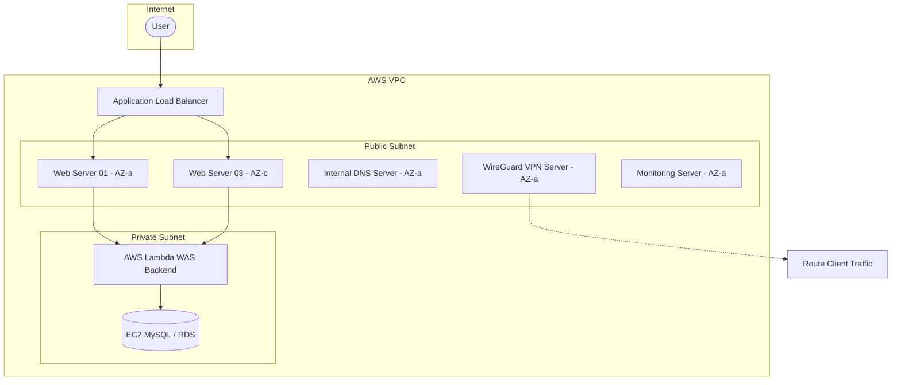

# AWS Infrastructure IaC (Dev Environment)

이 프로젝트는 AWS 상에 고가용성 3-Tier 웹 애플리케이션 아키텍처 및 모니터링, DNS, VPN 시스템을 구축하기 위한 Terraform(테라폼) 코드입니다.

---

## 🏗️ 시스템 아키텍처 개요

이 프로젝트를 통해 배포되는 전체 인프라 구성은 다음과 같습니다.



### 1. Network & Load Balancing
* **VPC & Subnet**: `modules/subnet` 공통 모듈(템플릿)을 통해 `main.tf`에서 필요한 가용 영역(AZ-a, AZ-c) 및 CIDR 대역을 동적으로 선언합니다.
* **Gateways & Routing**: 인터넷 게이트웨이(IGW), NAT 게이트웨이(NGW), EIP 및 기본 라우팅(`0.0.0.0/0`)이 `gw.tf`로 분리되어 모듈 간 순환 의존성 없이 유연하게 트래픽을 처리합니다.
* **Application Load Balancer (ALB)**: 외부 트래픽을 수신하여 다중 AZ 퍼블릭 서브넷의 Web 인스턴스들에 부하를 분산합니다.

### 2. Compute (EC2 & 모듈화)
* **Web Server**: 다중 가용영역(AZ-a, AZ-c)에 분산 배치되며, ALB 타겟 그룹에 자동으로 등록됩니다.
* **Monitoring Server**: Prometheus, Grafana, Loki를 구동하는 전용 모니터링 서버(`m7i-flex.large`)입니다.
* **Internal DNS Server**: `dev.internal` 도메인 해석을 담당하는 Bind9 기반 사설 DNS 네임서버입니다.
* **WireGuard VPN Server**: VPC 내부 자원 및 사설 도메인에 안전하게 접근할 수 있는 VPN 터널을 제공합니다.
* **Database Server**: 비용 효율성을 위해 셀프호스팅된 EC2 MySQL(`t3.micro`) 인스턴스입니다.

### 3. Serverless Backend (WAS)
* **AWS Lambda**: Python 3.11 런타임 기반의 백엔드 API 서버입니다. 다중 AZ 프라이빗 서브넷 내부에서 안전하게 실행되며, Function URL을 통해 프론트엔드와 통신합니다.

---

## 📂 프로젝트 폴더 구조

```text
Dev/
├── modules/
│   ├── vpc/                 # VPC 본체 및 라우팅 테이블 껍데기 모듈
│   ├── subnet/              # 서브넷 생성 및 라우팅 테이블 자동 연결 모듈
│   ├── ec2/                 # EC2 인스턴스 공통 배포 모듈
│   └── user_data/           # 인스턴스 초기화 템플릿 (.tpl) 및 Promtail 쉘 스크립트
├── monitoring_test-scripts/ # 모니터링 및 알람 시스템 검증용 부하/장애 테스트 스크립트
├── gw.tf                    # Internet Gateway, NAT Gateway, EIP 및 기본 라우팅 경로
├── alb.tf                   # Application Load Balancer 및 리스너/타겟그룹 설정
├── main.tf                  # 서브넷 동적 선언, EC2 인스턴스 배포 등 메인 오케스트레이션
├── rds.tf                   # MySQL RDS 인스턴스 및 Multi-AZ 서브넷 그룹 설정 (백업 보관)
├── lambda.tf                # WAS Lambda 함수, VPC Config 및 Function URL 설정
├── sg.tf                    # 보안 그룹(Security Group) 방화벽 규칙 정의
├── ssm.tf                   # AWS Systems Manager Parameter Store 설정 (민감 정보 관리)
├── provider.tf              # AWS Provider 및 S3 Remote Backend 설정
├── variables.tf             # 전역 변수 정의
├── dev.tfvars               # [로컬 전용] 개발 환경 변수 값 정의 (Git 커밋 금지)
├── CHANGELOG.md             # [신규] 아키텍처 개편 및 변경 이력 상세 기록
└── README.md                # 인프라 가이드 및 매뉴얼
```

---

## 🛠️ User Data 초기화 스크립트 설명

`modules/user_data/` 디렉토리에 위치한 `.tpl` 템플릿들은 EC2 인스턴스가 최초 부팅될 때 필요한 패키지와 설정을 자동으로 적용합니다.

* **`common.sh`**: 공통 의존성 패키지 설치 및 사용자 권한 에러 방지 등을 처리하는 전체 EC2 공통 초기화 스크립트입니다.
* **`web-server.tpl`**: 기본적인 웹 데몬 구동 및 로컬 로그 수집기인 Promtail 설정을 처리합니다.
* **`monitor-server.tpl`**: 시스템 전체 모니터링을 위해 Prometheus, Grafana, Loki를 내려받고 systemd 서비스로 등록하여 시작합니다.
* **`internal-dns-server.tpl`**: Bind9을 이용해 사설 DNS 네임서버를 구성합니다. `dev.internal` 도메인으로 내부 Web 및 Monitoring 서버 IP들을 관리합니다.
* **`vpn-server.tpl`**: WireGuard VPN 데몬을 기동하고, 트래픽 포워딩(NAT) 설정 및 내부 DNS인 `10.0.1.53`를 바라보도록 환경을 구성합니다.
* **`db-server.tpl`**: MariaDB/MySQL 자동 설치, 원격 접속 허용 및 초기 DB/유저를 생성합니다.

---

## 🧪 모니터링 검증 및 부하 테스트 스크립트 (`monitoring_test-scripts/`)

Prometheus, Grafana, Loki 대시보드와 Alert Manager를 검증하기 위한 인위적 장애 유발 스크립트입니다.

* **`cpu-load-check_uptime.sh`**: 서버의 `uptime` 및 웹 응답 속도/상태 코드를 지속적으로 캡처하여 로그 파일에 기록합니다.
* **`cpu-load-test_with-web-traffic.sh`**: 웹 서버로 연속적인 HTTP 요청을 발송하며 부하를 생성합니다.
* **`disk-state-record.sh`**: 디스크 용량(`df`), 아이노드(`df -i`), 블록 디바이스(`lsblk`), I/O 성능(`iostat`)을 주기적으로 로그로 남깁니다.
* **`disk-write-state_check.sh`**: 지속적인 디스크 쓰기 동작을 유발하며 디스크 메트릭 변화를 체크합니다.
* **`memory_make-oom_test.sh`**: 메모리 상한을 강제하고 메모리를 대량 할당하여 OOM(Out of Memory) 장애 상황을 유발합니다.
* **`traffic-test_web.sh`**: 로컬 웹 서버에 정상 200 OK 및 404 Not Found 요청 트래픽을 지속적으로 생성합니다.

---

## 🔑 WireGuard VPN 접속 및 사용 방법

개발망(VPC Private Subnet)의 자원들과 내부 사설 도메인(`*.dev.internal`)에 로컬 PC에서 안전하게 접속하기 위해 VPN 터널을 이용합니다.

### 1. 클라이언트(사용자 PC) 키 생성
```bash
wg genkey | tee /etc/wireguard/private.key | wg pubkey > /etc/wireguard/public.key
```

### 2. 클라이언트 설정 파일 작성 (`/etc/wireguard/wg0.conf`)
```ini
[Interface]
Address = 10.100.0.2/24
PrivateKey = <클라이언트 개인키>
DNS = 10.0.1.53

[Peer]
PublicKey = <서버 공개키 (s_pub_key)>
Endpoint = <VPN 서버 퍼블릭 IP>:51820
AllowedIPs = 10.0.0.0/16, 10.100.0.0/24
PersistentKeepalive = 25
```

### 3. 접속 테스트
```bash
nslookup web01.dev.internal
# 10.0.1.10으로 해석되면 정상입니다.
```

---

## 🚀 시작하기 (How to Run)

### 1. 사전 준비 사항
* **AWS CLI** 설치 및 자격 증명 구성
* **Terraform CLI** (v1.2 이상 권장) 설치
* **S3 Bucket 생성**: 테라폼 상태 파일(`terraform.tfstate`) 저장용 버킷

### 2. 환경 변수 파일 작성 (`dev.tfvars`)
```hcl
db_username  = "admin"
db_password  = "보안이_강력한_패스워드"
my_public_ip = "본인의_퍼블릭_IP_대역/32"
project      = "my-project"
```

### 3. 배포 명령어
```bash
# 초기화
terraform init

# 변경 계획 확인
terraform plan -var-file="dev.tfvars"

# 인프라 배포
terraform apply -var-file="dev.tfvars"
```

---

## 🔒 보안 주의사항 (Security)

1. **State 파일 보호**: 원격 S3 Backend를 활용하여 민감 정보가 담긴 state 파일을 안전하게 관리합니다.
2. **Access Key 노출 금지**: AWS 자격 증명이나 Key Pair(`.pem`)를 절대 코드에 하드코딩하거나 커밋하지 마십시오.
3. **Security Groups 최소 권한**: SSH(22번 포트), Grafana(3000), Prometheus(9090)는 `var.my_public_ip` 변수를 통해 지정된 IP에서만 인바운드를 허용하십시오.

---

## 📜 변경 이력 및 아키텍처 개선 과정

👉 인프라 모듈화, 비용 최적화, Multi-AZ 구성 및 트러블슈팅 상세 내역은 **[CHANGELOG.md](./CHANGELOG.md)**에서 확인하실 수 있습니다.
