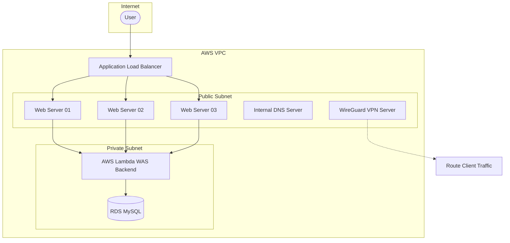

# AWS Infrastructure IaC (Dev Environment)

이 프로젝트는 AWS 상에 고가용성 3-Tier 웹 애플리케이션 아키텍처 및 모니터링, DNS, VPN 시스템을 구축하기 위한 Terraform(테라폼) 코드입니다.

---

## 🏗️ 시스템 아키텍처 개요

이 프로젝트를 통해 배포되는 전체 인프라 구성은 다음과 같습니다.



### 1. Network & Load Balancing
* **VPC & Subnet**: 퍼블릭 및 프라이빗 서브넷이 구분된 격리된 네트워크 환경을 구성합니다.
* **Application Load Balancer (ALB)**: 외부 트래픽을 수신하여 퍼블릭 서브넷의 Web 인스턴스 3개에 부하 분산합니다.

### 2. Compute (EC2 & 모듈화)
* **Web Server (3개)**: 고가용성을 위해 다중 가용영역(AZ) 서브넷에 분산 배치되며, ALB 타겟 그룹에 자동으로 연결됩니다.
* **Monitoring Server**: Prometheus 및 Grafana 등을 구동하기 위한 모니터링 서버(m7i-flex.large)입니다.
* **Internal DNS Server**: 내부 VPC 내 도메인 해석을 담당하는 자체 DNS 서버입니다.
* **WireGuard VPN Server**: 보안 강화를 위해 VPC 내부망 접속을 제공하는 가상 사설망(VPN) 서버입니다.

### 3. Serverless Backend (WAS)
* **AWS Lambda**: Python 3.11 런타임 기반의 백엔드 API 서버입니다. 프라이빗 서브넷 내부에서 작동하며, API Gateway/Function URL을 통해 퍼블릭으로 안전하게 호출할 수 있도록 CORS 설정을 제공합니다.

### 4. Database (RDS)
* **RDS MySQL 8.0**: 프라이빗 서브넷 내에 위치하여 외부 노출을 최소화하며, Lambda 함수를 통해서만 데이터에 접근하도록 구성되어 있습니다.

---

## 📂 프로젝트 폴더 구조

```text
Dev/
├── modules/
│   ├── vpc/             # VPC, 서브넷, 라우팅 테이블 구성 모듈
│   ├── ec2/             # EC2 인스턴스 공통 생성 모듈
│   └── user_data/       # 인스턴스 초기화 템플릿 (.tpl) 및 Promtail 쉘 스크립트
├── alb.tf               # Application Load Balancer 및 리스너 설정
├── main.tf              # EC2 인스턴스, VPN 라우트 호출 등 메인 인프라 오케스트레이션
├── rds.tf               # MySQL RDS 인스턴스 및 서브넷 그룹 설정
├── lambda.tf            # WAS Lambda 함수, 권한 및 Function URL 설정
├── sg.tf                # 인프라 요소별 방화벽(Security Group) 규칙
├── ssm.tf               # AWS Systems Manager 파라미터 스토어 설정 (DB 패스워드 등 관리)
├── provider.tf          # AWS 프로바이더 및 S3 Backend 설정
├── variables.tf         # 입력 변수 정의
├── dev.tfvars           # [로컬 전용] 개발 환경 변수 값 정의 (Git 커밋 금지)
└── .gitignore           # 테라폼 상태 및 민감 정보 업로드 방지 규칙
```

---

## 🛠️ User Data 초기화 스크립트 설명

`modules/user_data/` 디렉토리에 위치한 `.tpl` 템플릿들은 EC2 인스턴스가 최초 구동(부트스트랩)될 때 자동으로 설정 및 데몬을 기동시키는 역할을 합니다.

* **`common.sh`**: 공통 의존성 패키지 설치 및 사용자 권한 에러 방지 등을 처리하는 전체 EC2 공통 초기화 스크립트입니다.
* **`web-server.tpl`**: 기본적인 웹 데몬 구동 및 로컬 로그 수집기인 Promtail 설정을 처리합니다.
* **`monitor-server.tpl`**: 시스템 전체 모니터링을 위해 Prometheus, Grafana, Loki를 내려받고 systemd 서비스로 등록하여 시작합니다.
* **`internal-dns-server.tpl`**: Bind9을 이용해 사설 DNS 네임서버를 구성합니다. `dev.internal` 도메인으로 내부 Web 및 Monitoring 서버 IP들을 관리합니다.
* **`vpn-server.tpl`**: WireGuard VPN 데몬을 기동하고, 트래픽 포워딩(NAT) 설정 및 내부 DNS인 `10.0.1.53`를 바라보도록 환경을 구성합니다.

---

## 🔑 WireGuard VPN 접속 및 사용 방법

개발망(VPC Private Subnet)의 자원들(RDS MySQL, WAS Lambda)과 내부 도메인(`*.dev.internal`)에 로컬 PC에서 안전하게 접속하기 위해 VPN 터널을 이용합니다.

### 1. 클라이언트(사용자 PC)/서버 준비
1. [WireGuard 공식 웹사이트](https://www.wireguard.com/install/)에서 운영체제에 맞는 클라이언트 프로그램을 설치합니다.
2. 클라이언트 개인키(`c_pri_key`)와 공개키(`c_pub_key`)를 생성합니다. (공개키는 테라폼 변수에 입력되어 서버 측에 Peer 등록되어야 합니다.)
```bash
wg genkey | tee /etc/wireguard/private.key | wg pubkey > /etc/wireguard/public.key'
```

### 2.1 클라이언트 설정 파일 작성
/etc/wireguard/wg0.conf를 생성하고, 아래 설정 파일 예시를 채워 넣습니다.

```ini
[Interface]
# 로컬 가상 네트워크 인터페이스 정보
Address = 10.100.0.2/24
PrivateKey = <클라이언트 개인키>
# VPC 내부 네임서버를 바라보도록 설정
DNS = 10.0.1.53

[Peer]
# VPN 서버의 공개키
PublicKey = <서버 공개키 (s_pub_key)>
# VPN 서버의 공인(Public) IP와 포트
Endpoint = <VPN 서버 퍼블릭 IP>:51820
# VPN 터널을 통해 전송할 목적지 네트워크 대역 (VPC CIDR 및 VPN 가상 대역)
AllowedIPs = 10.0.0.0/16, 10.100.0.0/24
# 연결 유지 주기 (NAT 세션 끊김 방지)
PersistentKeepalive = 25
```

### 2.2. 서버 설정 파일 작성
코드 안에 포함되어있습니다. 


### 3. 접속 테스트
1. WireGuard 클라이언트에서 `활성화(Activate)` 버튼을 클릭합니다.
2. 연결 성공 후 터널이 가동되면 터미널을 열고 내부 DNS 해석이 올바르게 진행되는지 검증합니다:
   ```bash
   nslookup web01.dev.internal
   # 출력 결과가 10.0.1.10으로 해석되면 정상입니다.
   ```

---

## 🚀 시작하기 (How to Run)


### 1. 사전 준비 사항
* **AWS CLI** 설치 및 자격 증명(Access Key/Secret Key) 구성
* **Terraform CLI** (v1.2 이상 권장) 설치
* **S3 Bucket 생성**: 테라폼 상태 파일(tfstate)을 저장할 S3 버킷을 미리 생성해 두어야 합니다. (`provider.tf`의 `backend "s3"` 부분 참고)

### 2. 환경 변수 파일 생성 (`dev.tfvars`)
로컬 환경에서 테라폼을 배포할 때 입력할 변수를 설정하기 위해 `dev.tfvars` 파일을 생성하고 값을 기입합니다.
> [!IMPORTANT]
> 이 파일은 패스워드 및 개인 IP를 담고 있으므로 절대 Git에 커밋되지 않도록 주의해야 합니다. (`.gitignore`로 자동 제외됨)

```hcl
# dev.tfvars 예시
db_username  = "admin"
db_password  = "보안이_강력한_패스워드"
my_public_ip = "본인의_퍼블릭_IP_대역/32"
project      = "my-project"
```

### 3. 테라폼 명령어 실행

**초기화 (S3 백엔드 및 플러그인 로드)**
```bash
terraform init
```

**인프라 변경 계획 확인**
```bash
terraform plan -var-file="dev.tfvars"
```

**인프라 실제 배포**
```bash
terraform apply -var-file="dev.tfvars"
```

---

## 🔒 보안 주의사항 (Security)

1. **상태 파일 관리 (`*.tfstate`)**: State 파일에는 데이터베이스 패스워드 등 테라폼이 관리하는 모든 민감 정보가 평문으로 포함됩니다. 원격 S3 Backend를 활용해 협업 및 안전하게 격리 보관하십시오.
2. **Access Key 노출 금지**: 절대 AWS 계정 자격 증명이나 Key Pair(`.pem`)를 프로젝트 내에 저장하거나 커밋하지 마십시오.
3. **Security Groups**: `sg.tf`에서 SSH(22번 포트)나 모니터링 콘솔(Grafana 3000, Prometheus 9090) 등 관리용 포트는 가급적 `var.my_public_ip` 변수를 사용하여 본인의 IP 대역으로만 접근을 허용하도록 제한하십시오.
